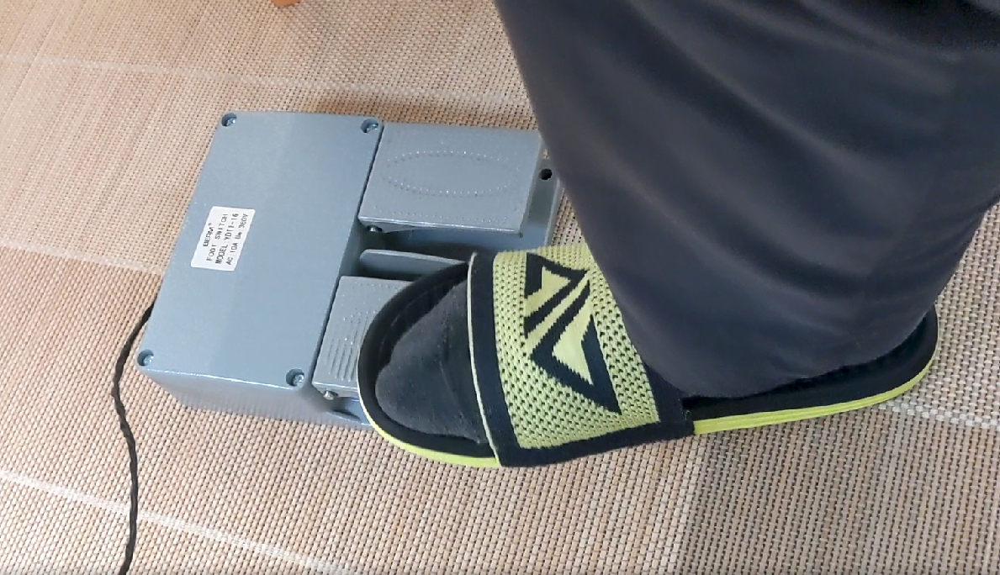
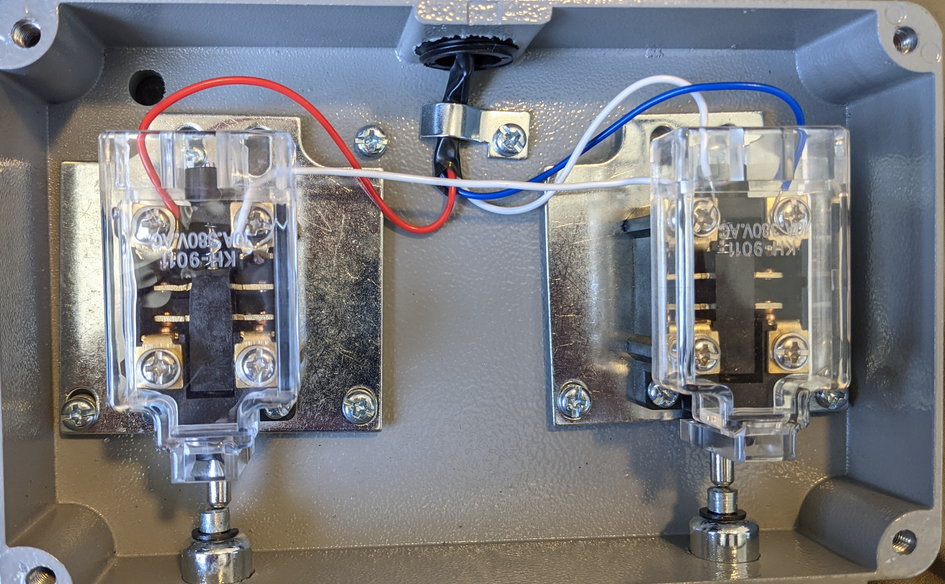

# Vim Mode Switch

Another way to switch between VIM modes.

## How to build

Prepare an Arduino, a switch and some cable.

Connect your device as follow:

## How to use

Using Padel to control vim mode.

- while pressing the left padel, send an "a" (or "i") to the computer and send an ESC after released.
- while pressing the right padel, send a "v" to the computer and send an ESC key after released.

Just like the brake and throttle in the vehicle, you should use only one foot to control it for avoiding press 2 pedals at the same time.

Some practices are required in the beginning, and it'll be very easy to use after you got used to it.

You can modify the `src/vim_pedal.ino` and flash it to Arduino, not only control VIM, but you can also program it to input password or play games.

## References

- Inspired by: [alevchuk/vim-clutch](https://github.com/alevchuk/vim-clutch)
- [知乎上的一些讨论](https://www.zhihu.com/question/30811191)
- [arduino keyboard library](https://www.arduino.cc/reference/en/language/functions/usb/keyboard/)
    - These core libraries allow the 32u4 and SAMD based boards **(Leonardo, Esplora, Zero, Due and MKR Family)** to appear as a native Mouse and/or Keyboard to a connected computer.
    - I'm using [KKHMF](https://www.amazon.co.jp/gp/product/B081DY1NWW), it's compatible with Arduino Leonardo and already the cheapest chip I can find. 
        - I guess using Taobao, you can buy the cheaper boards...
- About the footswitch, finally, I chose YDT1-16 (basically, any switch is OK).
    - This one is too heavy (around 1.5kg)
    - https://detail.tmall.com/item.htm?id=9350412322
    - https://www.amazon.co.jp/gp/product/B08KXMM3VM
