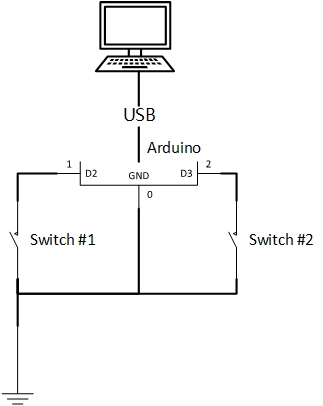

# Vim Mode Switch

Some other ways to swicth between VIM modes.

## How to build

Prepare an arduino, a switch and some cabel.

Connect your device as follow:

## How to use

Using Padel to control vim mode.

- while pressed the left padel, send a "a" (or "i") to computer and send a ESC key after you released.
- while pressed the right padel, send a "v" to computer and send a ESC key after you released.

Just like the brake and throttle in the vehicle, you should use right foot (if you haven't lost it) to control it for avoiding press them at same time.

Need some practice in the beginning, and it'll be very easy to use after you got used to it.

You can modify the `src/vim_pedal.ino` and flash it to arduino, not only control VIM, you can also program it to input password or play game.

## References

- Inspired by: [alevchuk/vim-clutch](https://github.com/alevchuk/vim-clutch)
- [知乎上的一些讨论](https://www.zhihu.com/question/30811191)
- [arduino keyboard library](https://www.arduino.cc/reference/en/language/functions/usb/keyboard/)
    - These core libraries allow the 32u4 and SAMD based boards **(Leonardo, Esplora, Zero, Due and MKR Family)** to appear as a native Mouse and/or Keyboard to a connected computer.
    - I'm using [KKHMF](https://www.amazon.co.jp/gp/product/B081DY1NWW), it's compatible with Arduino Leonardo and already the cheapest chip I can find. 
        - I guess using Taobao, you can buy the cheaper borads...
- For the foot switch, finally I choose YDT1-16 (basically, any switch is OK).
    - This one is too heavy (around 1.5kg)
    - https://detail.tmall.com/item.htm?id=9350412322
    - https://www.amazon.co.jp/gp/product/B08KXMM3VM

